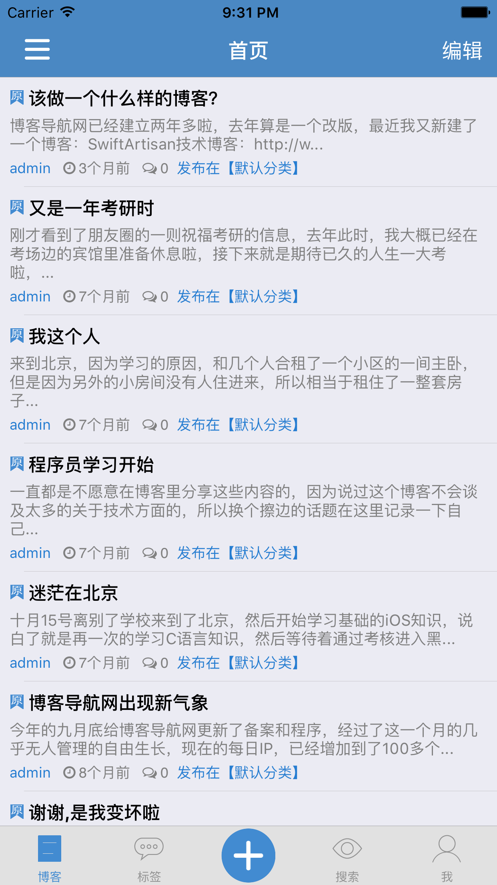
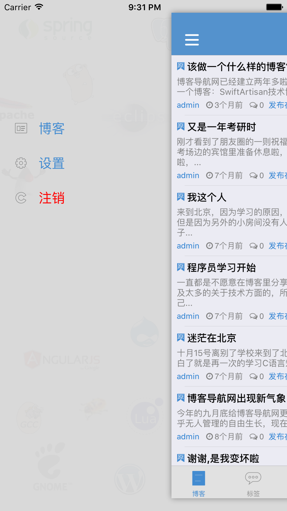
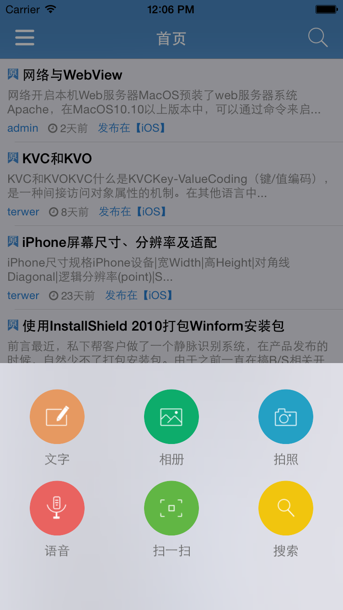
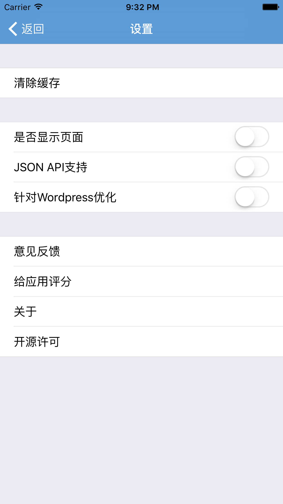

# WBSBlog

著名开源内容管理系统Wordpress的移动iOS版（非官方），目前仅支持Wordpress，后续将开放支Zblog

WBSBlog is an open source *Wordpress* client for iOS, released under the Apache License V2. The author stole the idea from [Terwer](https://github.com/terwer) ’s [OneBlogiOS](https://github.com/terwer/OneblogiOS) , so that people can make crappy clones.

## 目录简介
* API ——— 包含API和API返回数据的封装模型
* Utils、Lib ——— 常用的工具方法、类扩展及第三方库
* home、tag、publish...... ——— 各个具体界面
* Main ViewControllers ——— 主要的视图控制器（作为基类或使用较广的控制器）

演示
---
1、博客首页

2、导航

3、发布

4、设置

## 运行项目
1. 下载zip文件
2. 打开project即可

## 项目用到的开源类库、组件

序号 | 类库名称 | 说明
------------- | ------------- | -------------
1             | AFNetworking  | 网络请求
2            | TGMetaWeblogApi | MetaWeblogApi https://github.com/terwer/TGMetaWeblogApi
3            | SDFeedParser | Wordpress JSON API https://github.com/terwer/SDFeedParser
4             | RESideMenu       | 侧拉栏
5             | MBProgressHUD    | 显示提示或加载进度
6             | SDWebImage       | 加载网络图片和缓存图片
7             | TTTAttributedLabel | 支持富文本显示的label
8             | GPUImage         | 实现模糊效果
9             | Mansory | 自动布局框架
10            | FontAwesome      | 图标字体（ http://fortawesome.github.io/Font-Awesome/icons/ ）
11            | MZDayPicker      | 日期
12            | ToMarkdown       | 解析文章为markdown
13            | GHMarkdownParser  |解析文章为HTML

## 开源协议

Oneblog app is under the Apache License V2. See [the LICENSE file](https://github.com/terwer/OneblogiOS/blob/master/LICENSE.md) for more details.

更新记录
======
v0.1.1 2016-07-19

>1、完善项目介绍。

>2、修改pch文件。

v0.1 2016-07-19

>1、创建项目。

>2、完善基本界面。

版本信息
-------
>版本: V0.1.1

>作者: Weberson Gao

>作者博客：http://www.swiftartisan.com

>作者邮箱: weberson@163.com

参考资料
=======

1、[OneBlogiOS](https://github.com/terwer/OneblogiOS)

2、[WP_REST_API_Documentation](http://v2.wp-api.org)

3、[WP REST API](https://github.com/webersongao/WBSBlog/blob/master/OtherResource/wordpress-json-api-http-sample-data.md)
4、[iUnlocker](https://github.com/iMuFeng/iUnlocker)

